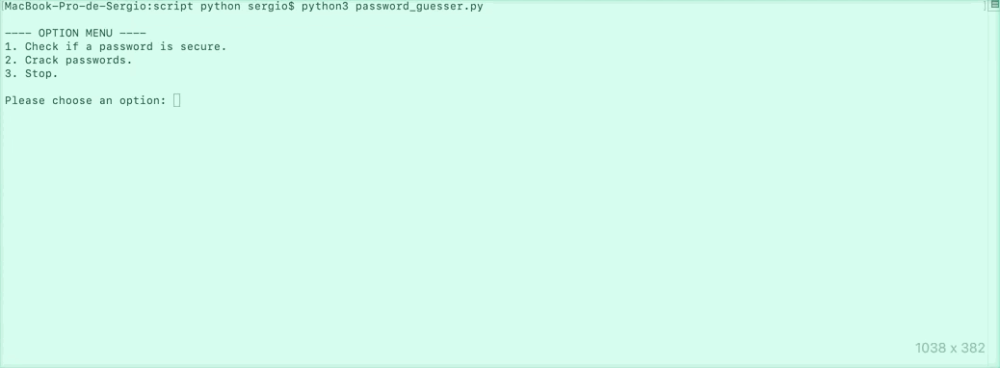

# AuditPY
<h6>I am not responsible for the bad use of this tool. Always use it for ethical purposes.</h6>
AuditPY is a basic Python script that is targeted to cybersecurity. There are two key features, password audition and password cracking.  

<h3>Password audition</h3>
It follows a basic procedure while checking if your password is wether secure or not. A password is considered secure when it has more than 8 characters, and it contains 3 out of the 4 following principles:  

+ It has at least one **uppercase letter**.
+ It has at least one **lowercase letter**.
+ It has at least one **number**.
+ It has at least one **symbol**.  

 
As you can see, with a simple run you can test if a password is secure or not, all you have to do is select the desired option in the menu, and you will have to enter the password to check if it's secure to use.

